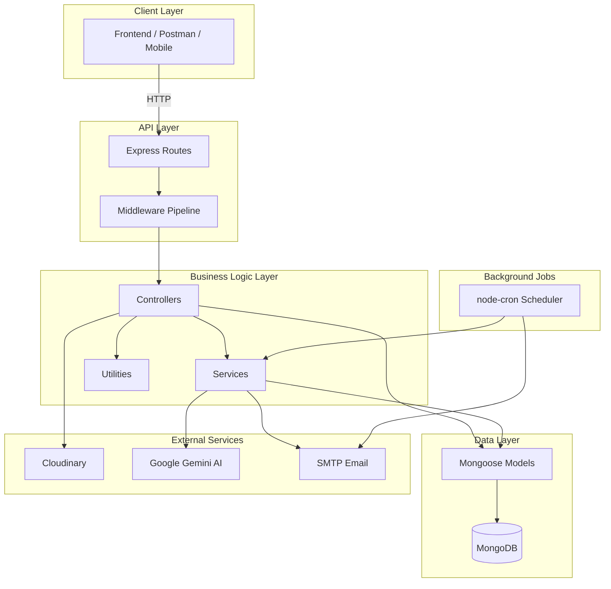
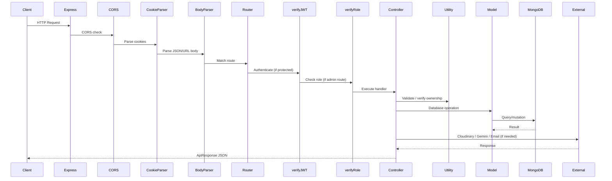
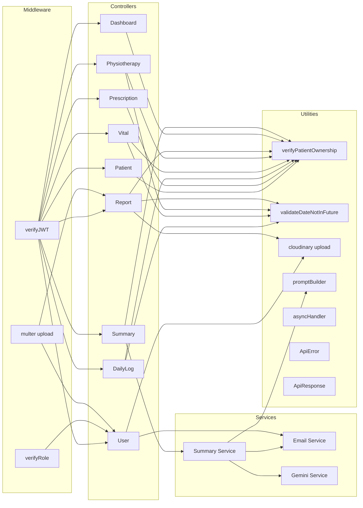
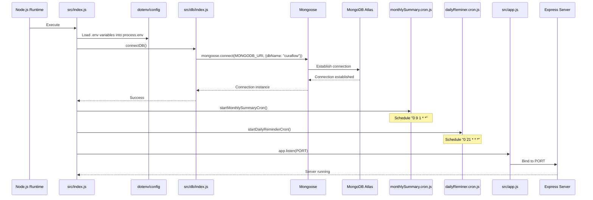
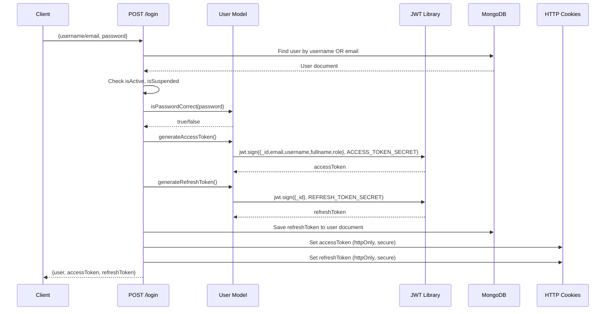
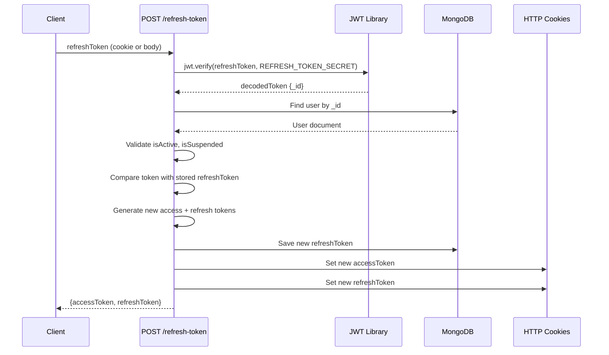
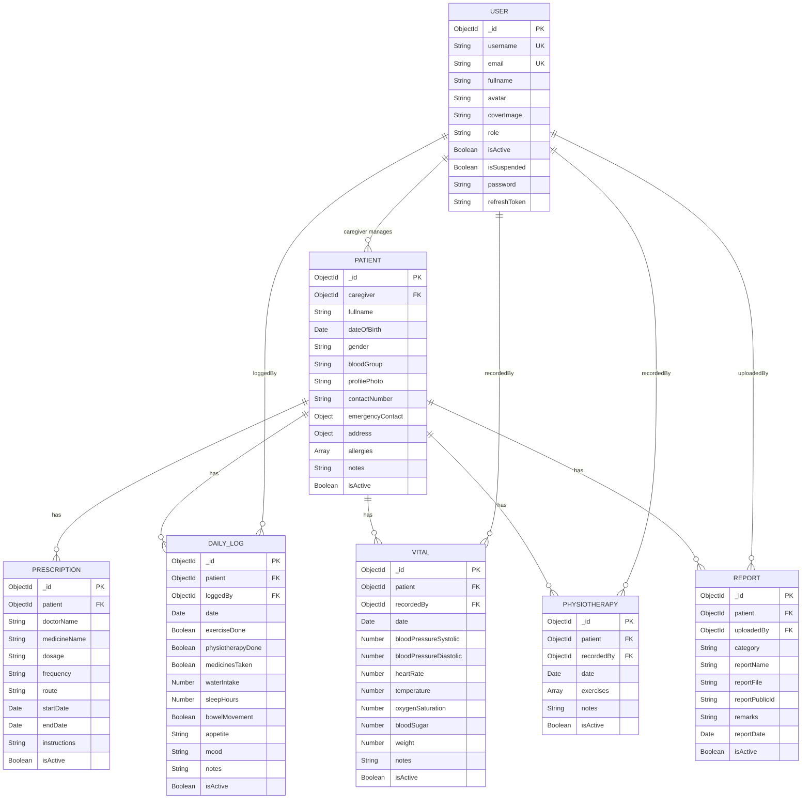
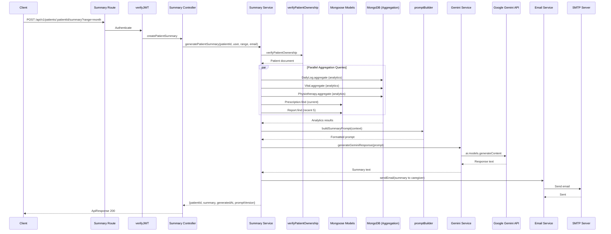
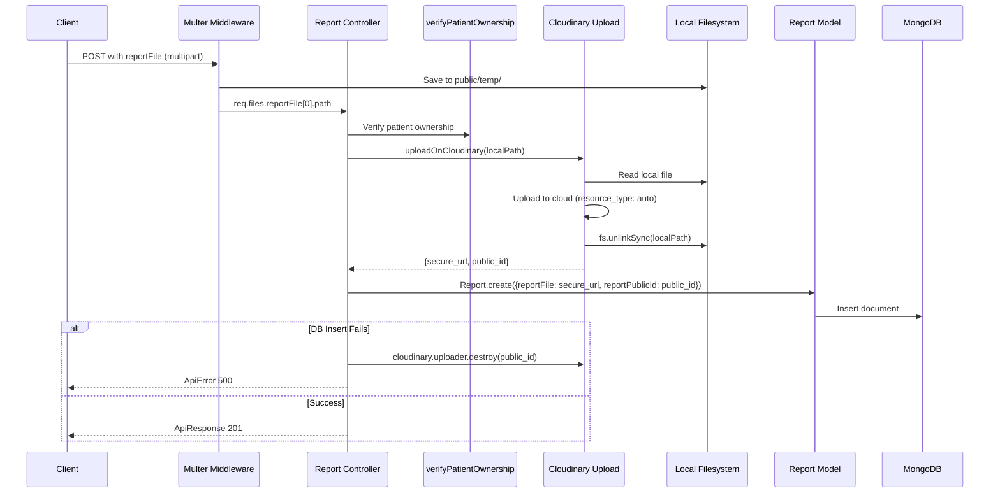
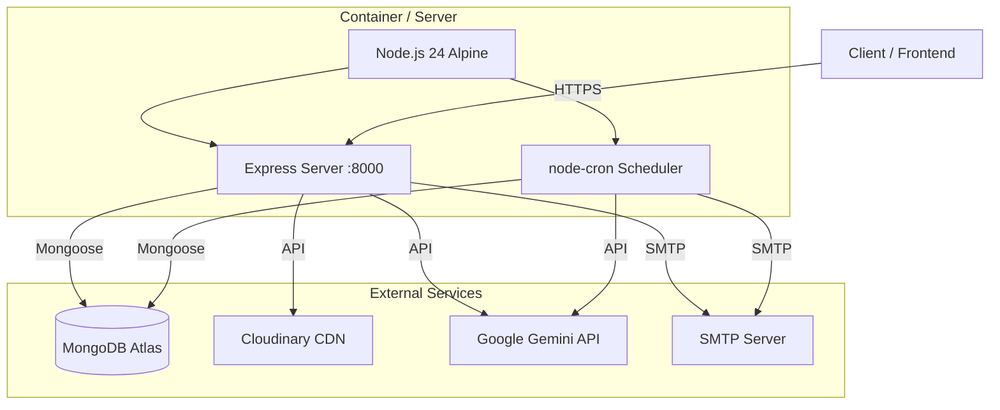

# CuraFlow Backend — Technical Design Document

---

## 1. Document Control

| Field | Value |
|---|---|
| **Document Title** | CuraFlow Backend — Technical Design Document |
| **Project Name** | CuraFlow Backend |
| **Document Purpose** | Provide a comprehensive, single-source technical reference for the CuraFlow Backend system covering architecture, data models, API surface, integrations, deployment, and operational concerns. |
| **Scope** | Covers the entire backend repository: application initialization, all modules (Users, Patients, Prescriptions, Daily Logs, Vitals, Physiotherapy, Reports, Dashboard, AI Summary), middleware, services, cron jobs, external integrations, database design, security, and deployment. |
| **Intended Audience** | New and existing developers, technical leads, code reviewers, interviewers, and technical evaluators. |
| **Document Version** | 1.0.0 |
| **Last Updated** | 2026-07-13 |
| **Document Conventions** | File paths are relative to the repository root unless stated otherwise. Environment variable names appear in `UPPER_SNAKE_CASE`. Code references link to exact source files. Mermaid diagrams use valid Mermaid syntax. Actual secret values are never disclosed. |

---

## 2. Introduction

### 2.1 Project Overview

CuraFlow is a healthcare caregiver management platform with AI-powered recovery summaries. The backend provides a RESTful API that enables caregivers to register, manage patients, track prescriptions, log daily care activities, record vital signs, document physiotherapy sessions, upload medical reports, and generate AI-driven patient summaries using Google Gemini.

### 2.2 Problem Being Addressed

Healthcare caregivers need a centralized, structured system to track patient recovery progress across multiple dimensions — medications, vitals, daily wellness, physiotherapy, and medical reports. CuraFlow addresses this by providing a unified backend API that aggregates health data, enforces data integrity through date normalization and unique-per-day constraints, and leverages generative AI to produce actionable patient summaries.

### 2.3 Purpose of the Backend

The backend serves as the data management and business logic layer for the CuraFlow platform. It handles user authentication, patient record management, health data tracking across five clinical modules, file upload to cloud storage, email notifications, scheduled background jobs, and AI-powered summary generation.

### 2.4 System Objectives

- Provide secure, role-based access to patient health data for caregivers and administrators
- Enforce data integrity with one-record-per-patient-per-day constraints on daily logs, vitals, and physiotherapy
- Integrate with Google Gemini AI to generate clinical summaries from aggregated analytics
- Automate daily care reminders and monthly AI-generated progress reports via email
- Support file upload and cloud storage for medical reports and user profile images

### 2.5 Major Capabilities

| Capability | Description |
|---|---|
| **User Management** | Registration (admin-only), login, logout, token refresh, profile management, caregiver suspension/deletion |
| **Patient Management** | CRUD with pagination, search, soft-delete |
| **Prescription Tracking** | Full CRUD, search, current/expiring medicines, medicine timeline |
| **Daily Log Tracking** | Daily wellness logging, today/weekly views, missed medicine tracking |
| **Vital Signs Recording** | Vital recording with analytics aggregation (week/month/6months/all) |
| **Physiotherapy Tracking** | Session logging with exercise sub-documents, today/weekly views |
| **Medical Reports** | File upload to Cloudinary, category/date filtering, file replacement with cleanup |
| **Dashboard** | Caregiver-level and patient-level aggregated dashboards |
| **AI Summary** | Gemini-powered patient recovery summaries with email delivery |
| **Scheduled Jobs** | Daily care reminders (9 PM) and monthly AI summary reports (1st of month, 9 AM) |
| **Email Notifications** | Welcome emails, daily reminders, AI summary delivery |

### 2.6 Scope of the Implemented Backend

The backend is a fully implemented RESTful API. It does not include a frontend client, WebSocket/real-time features, payment processing, or multi-tenancy beyond the admin/caregiver role distinction.

---

## 3. Technology Stack

| Technology | Version | Role in Project |
|---|---|---|
| **Node.js** | 24 (Alpine Docker image) | JavaScript runtime environment |
| **JavaScript (ES Modules)** | ESM (`"type": "module"`) | Programming language with native ESM imports |
| **Express.js** | 5.2.1 | HTTP server framework, routing, middleware pipeline |
| **MongoDB** | Cloud-hosted (Atlas) | NoSQL document database for all persistent data |
| **Mongoose** | 9.7.2 | MongoDB ODM — schema definitions, validation, hooks, indexing, aggregation |
| **JWT (jsonwebtoken)** | 9.0.3 | Access and refresh token generation/verification for authentication |
| **bcrypt** | 6.0.0 | Password hashing (salt rounds: 10) |
| **Cloudinary** | 2.10.0 | Cloud image/file storage for avatars, cover images, and medical reports |
| **Multer** | 2.2.0 | Multipart file upload middleware with temporary disk storage |
| **Nodemailer** | 9.0.1 | SMTP email delivery for notifications |
| **Google GenAI SDK** | 2.10.0 (`@google/genai`) | AI-powered patient summary generation via Gemini models |
| **node-cron** | 4.5.0 | Cron-based scheduling for daily reminders and monthly summaries |
| **dotenv** | 17.4.2 | Environment variable loading from `.env` files |
| **cookie-parser** | 1.4.7 | HTTP cookie parsing for token extraction |
| **cors** | 2.8.6 | Cross-Origin Resource Sharing configuration |
| **@faker-js/faker** | 10.5.0 | Realistic synthetic data generation for database seeding |
| **Docker** | Alpine-based | Containerized deployment |
| **Prettier** | 3.8.4 (dev) | Code formatting |
| **Nodemon** | 3.1.14 (dev) | Development auto-restart |
| **Newman** | 6.2.2 (dev) | Postman collection runner for API testing |

---

## 4. System Architecture

### 4.1 Architectural Style

The application follows a **layered monolithic architecture** with clear separation of concerns across routes, middleware, controllers, services, models, and utilities.

### 4.2 Application Layers



### 4.3 Request Lifecycle



### 4.4 Component Interactions



---

## 5. Repository and Directory Structure

```
CuraFlow-Backend/
├── .dockerignore              # Docker build exclusions
├── .env.sample                # Environment variable template
├── .gitignore                 # Git exclusions
├── .prettierignore            # Prettier format exclusions
├── .prettierrc                # Prettier configuration
├── Dockerfile                 # Docker container definition
├── README.md                  # Project README
├── package.json               # Project manifest and dependencies
├── package-lock.json          # Dependency lock file
│
├── docs/
│   └── benchmark/
│       ├── with-index-executionStats.png     # Index benchmark results
│       └── without-index-executionStats.png  # No-index benchmark results
│
├── postman_collection/
│   ├── CuraFlow API.postman_collection.json         # API test collection
│   └── Local Developement.postman_environment.json  # Local env variables
│
├── public/
│   └── temp/                  # Multer temporary upload directory
│
└── src/
    ├── index.js               # Application entry point
    ├── app.js                 # Express application configuration
    │
    ├── config/
    │   ├── gemini.js          # Google GenAI client initialization
    │   └── mailer.js          # Nodemailer transporter configuration
    │
    ├── constants/
    │   └── index.js           # Application constants (DB_NAME)
    │
    ├── controllers/
    │   ├── user.controller.js
    │   ├── patients.controller.js
    │   ├── prescription.controller.js
    │   ├── dailyLog.controller.js
    │   ├── vital.controller.js
    │   ├── physiotherapy.controller.js
    │   ├── report.controller.js
    │   ├── dashboard.controller.js
    │   └── summary.controller.js
    │
    ├── cron/
    │   ├── dailyReminer.cron.js     # Daily care reminder job
    │   └── monthlySummary.cron.js   # Monthly AI summary job
    │
    ├── db/
    │   └── index.js           # MongoDB connection logic
    │
    ├── middlewares/
    │   ├── auth.middleware.js   # JWT authentication
    │   ├── multer.middleware.js # File upload configuration
    │   └── role.middleware.js   # Role-based authorization
    │
    ├── models/
    │   ├── users.model.js
    │   ├── patients.model.js
    │   ├── prescription.model.js
    │   ├── dailyLog.model.js
    │   ├── vital.model.js
    │   ├── physiotherapy.model.js
    │   └── report.model.js
    │
    ├── routes/
    │   ├── user.routes.js
    │   ├── patients.routes.js
    │   ├── prescription.routes.js
    │   ├── dailyLog.routes.js
    │   ├── vital.routes.js
    │   ├── physiotherapy.routes.js
    │   ├── report.routes.js
    │   ├── dashboard.routes.js
    │   └── summary.routes.js
    │
    ├── scripts/
    │   ├── profiles/
    │   │   ├── medicationBundles.js    # Medication data profiles
    │   │   ├── recoveryCurves.js       # Recovery simulation curves
    │   │   └── strokeProfiles.js       # Stroke patient profiles
    │   └── seed/
    │       ├── seedDatabase.js               # Main seed orchestrator
    │       ├── clearDatabase.js              # Database cleanup
    │       ├── seedAdmin.js                  # Admin user creation
    │       ├── seedCaregivers.js             # Caregiver user creation
    │       ├── generatePatientProfiles.js    # Patient profile generation
    │       ├── seedPatients.js               # Patient insertion
    │       ├── seedPrescriptions.js          # Prescription insertion
    │       ├── seedDailyLogs.js              # Daily log insertion
    │       ├── seedVitals.js                 # Vital record insertion
    │       ├── seedPhysiotherapySessions.js  # Physiotherapy insertion
    │       ├── seedReports.js                # Report insertion
    │       └── createBenchmarkVitals.js      # 10K vital benchmark dataset
    │
    ├── services/
    │   ├── email.service.js     # Email sending with validation
    │   ├── gemini.service.js    # Gemini AI integration
    │   └── summary.service.js   # AI summary orchestration
    │
    ├── templates/
    │   ├── welcomeEmail.template.js        # Welcome email HTML
    │   ├── dailyReminderEmail.template.js  # Daily reminder email HTML
    │   └── summaryEmail.template.js        # AI summary email HTML
    │
    └── utils/
        ├── ApiError.js                  # Custom error class
        ├── ApiResponse.js               # Standardized response class
        ├── asyncHandler.js              # Async error wrapper
        ├── cloudinary.js                # Cloudinary upload utility
        ├── escapeHtml.js                # HTML entity escaping
        ├── normalizeToMidnightUTC.js    # Date normalization
        ├── promptBuilder.js             # AI prompt construction
        ├── validateDateNotInFuture.js   # Future-date validation
        └── verifyPatientOwnership.js    # Patient ownership check
```

### Directory Purposes

| Directory | Purpose |
|---|---|
| `src/config/` | Third-party client initialization (Gemini AI, Nodemailer transporter) |
| `src/constants/` | Application-wide constants (database name) |
| `src/controllers/` | Business logic handlers for each API module |
| `src/cron/` | Scheduled background jobs using node-cron |
| `src/db/` | MongoDB connection management via Mongoose |
| `src/middlewares/` | Express middleware for auth, file upload, and role checking |
| `src/models/` | Mongoose schema definitions with hooks, indexes, and methods |
| `src/routes/` | Express route declarations mapping URLs to middleware and controllers |
| `src/scripts/` | Database seeding and benchmark data generation scripts |
| `src/services/` | Encapsulated service layers for email, AI, and summary orchestration |
| `src/templates/` | HTML email templates with XSS-safe escaping |
| `src/utils/` | Shared utility functions used across the application |
| `public/temp/` | Temporary file storage for Multer uploads before Cloudinary transfer |
| `postman_collection/` | Postman API test collection and environment configuration |
| `docs/benchmark/` | Database index benchmark screenshots |

---

## 6. Application Initialization and Execution Flow

### 6.1 Entry Point

The application entry point is [src/index.js](file:///Users/shresthpastor/projects/Backend_Projects/CuraFlow-Backend/src/index.js).

### 6.2 Startup Sequence



### 6.3 Detailed Startup Steps

1. **Environment Loading**: `import "dotenv/config"` loads all variables from `.env` into `process.env` at the top of [src/index.js](file:///Users/shresthpastor/projects/Backend_Projects/CuraFlow-Backend/src/index.js#L1).

2. **Database Connection**: `connectDB()` in [src/db/index.js](file:///Users/shresthpastor/projects/Backend_Projects/CuraFlow-Backend/src/db/index.js) calls `mongoose.connect()` with `MONGODB_URI` and the database name `"curaflow"` from [src/constants/index.js](file:///Users/shresthpastor/projects/Backend_Projects/CuraFlow-Backend/src/constants/index.js). Connection failure calls `process.exit(1)`.

3. **Express Initialization**: [src/app.js](file:///Users/shresthpastor/projects/Backend_Projects/CuraFlow-Backend/src/app.js) creates the Express application and registers middleware in this order:
   - `cors()` — origin from `CORS_ORIGIN`, credentials enabled
   - `express.json()` — 16kb limit
   - `express.urlencoded()` — extended mode, 16kb limit
   - `cookieParser()` — parses cookies into `req.cookies`
   - `express.static("public")` — serves static files

4. **Route Mounting**: Nine route modules are mounted at versioned paths (`/api/v1/...`).

5. **Cron Job Registration**: Two cron jobs are registered before the server starts listening.

6. **Server Start**: `app.listen(process.env.PORT)` binds the HTTP server.

7. **Error Handling During Startup**: If `connectDB()` throws, the error is caught, logged, and the process exits with code 1.

---

## 7. Module-by-Module Documentation

---

### 7.1 User Module

#### Purpose

Manages caregiver and admin user accounts — registration, authentication, profile management, and administrative actions (suspension, deletion).

#### Relevant Files

| Type | File |
|---|---|
| Model | [src/models/users.model.js](file:///Users/shresthpastor/projects/Backend_Projects/CuraFlow-Backend/src/models/users.model.js) |
| Controller | [src/controllers/user.controller.js](file:///Users/shresthpastor/projects/Backend_Projects/CuraFlow-Backend/src/controllers/user.controller.js) |
| Routes | [src/routes/user.routes.js](file:///Users/shresthpastor/projects/Backend_Projects/CuraFlow-Backend/src/routes/user.routes.js) |
| Middleware | [auth.middleware.js](file:///Users/shresthpastor/projects/Backend_Projects/CuraFlow-Backend/src/middlewares/auth.middleware.js), [role.middleware.js](file:///Users/shresthpastor/projects/Backend_Projects/CuraFlow-Backend/src/middlewares/role.middleware.js), [multer.middleware.js](file:///Users/shresthpastor/projects/Backend_Projects/CuraFlow-Backend/src/middlewares/multer.middleware.js) |

#### Data Model — User

| Field | Type | Required | Unique | Default | Validation / Notes |
|---|---|---|---|---|---|
| `username` | String | Yes | Yes | — | Lowercase, trimmed, indexed |
| `email` | String | Yes | Yes | — | Trimmed |
| `fullname` | String | Yes | No | — | Trimmed, indexed |
| `avatar` | String | Yes | No | — | Cloudinary URL |
| `coverImage` | String | No | No | — | Cloudinary URL |
| `role` | String | No | No | `"caregiver"` | Enum: `["caregiver", "admin"]` |
| `isActive` | Boolean | No | No | `true` | Soft-delete flag |
| `isSuspended` | Boolean | No | No | `false` | Suspension flag |
| `password` | String | Yes | No | — | Hashed via bcrypt pre-save hook |
| `refreshToken` | String | No | No | — | Stored refresh token for session management |

**Timestamps**: `createdAt`, `updatedAt` (auto-managed by Mongoose).

**Indexes**: `username` (unique + explicit index), `email` (unique), `fullname` (explicit index).

**Schema Hooks**:
- `pre("save")`: Hashes password with bcrypt (salt rounds: 10) only when `password` field is modified.

**Instance Methods**:
- `isPasswordCorrect(password)`: Compares plaintext against stored hash using `bcrypt.compare`.
- `generateAccessToken()`: Signs JWT with `{_id, email, username, fullname, role}` using `ACCESS_TOKEN_SECRET` with `ACCESS_TOKEN_EXPIRY`.
- `generateRefreshToken()`: Signs JWT with `{_id}` using `REFRESH_TOKEN_SECRET` with `REFRESH_TOKEN_EXPIRY`.

#### API Endpoints

| Method | Endpoint | Purpose | Auth | Authorization |
|---|---|---|---|---|
| POST | `/api/v1/users/register` | Register new caregiver | Yes | Admin only |
| POST | `/api/v1/users/login` | User login | No | — |
| POST | `/api/v1/users/logout` | User logout | Yes | Any authenticated |
| POST | `/api/v1/users/refresh-token` | Refresh access token | No | Valid refresh token |
| PATCH | `/api/v1/users/change-password` | Change password | Yes | Any authenticated |
| GET | `/api/v1/users/current-user` | Get current user profile | Yes | Any authenticated |
| PATCH | `/api/v1/users/update-user-details` | Update email/fullname | Yes | Any authenticated |
| PATCH | `/api/v1/users/update-avatar` | Update avatar image | Yes | Any authenticated |
| PATCH | `/api/v1/users/update-cover-image` | Update cover image | Yes | Any authenticated |
| PATCH | `/api/v1/users/caregivers/:caregiverId/suspend` | Toggle caregiver suspension | Yes | Admin only |
| DELETE | `/api/v1/users/caregivers/:caregiverId` | Soft-delete caregiver | Yes | Admin only |

#### Controller Logic

- **`createCaregiver`**: Validates required fields (fullname, username, email, password), checks for duplicate username/email, requires avatar file upload via Multer, uploads avatar and optional cover image to Cloudinary, creates user with role `"caregiver"`, sends welcome email, and returns user (excluding password/refreshToken).

- **`loginUser`**: Accepts username or email + password. Validates user exists, checks `isActive` and `isSuspended` flags, verifies password, generates access + refresh tokens, stores refresh token in DB, sets both tokens as httpOnly secure cookies, and returns user data with tokens.

- **`logoutUser`**: Clears refresh token from DB, clears both cookie tokens.

- **`refreshAccessToken`**: Accepts refresh token from cookies or body, verifies JWT, validates user exists and is active/not-suspended, checks token matches stored token, generates new token pair, rotates refresh token in DB.

- **`changeCurrentPassword`**: Validates old password, confirms new password matches confirmation, saves new password (triggers bcrypt pre-save hook).

- **`updateUserAvatar` / `updateUserCoverImage`**: Accept file upload via Multer, upload to Cloudinary, update user record.

- **`suspendCaregiver`**: Admin-only. Toggles `isSuspended` flag on a caregiver.

- **`deleteCaregiver`**: Admin-only. Sets `isActive = false` and clears refresh token (soft-delete).

#### Business Rules

- Only admins can register new caregivers.
- Registration requires avatar image upload.
- Suspended or deactivated users cannot login or refresh tokens.
- Password changes require the old password.
- Refresh token rotation: each refresh generates a new token pair and invalidates the old refresh token.

---

### 7.2 Patient Module

#### Purpose

Manages patient records owned by caregivers. Provides CRUD operations with pagination, search, and soft-delete.

#### Relevant Files

| Type | File |
|---|---|
| Model | [src/models/patients.model.js](file:///Users/shresthpastor/projects/Backend_Projects/CuraFlow-Backend/src/models/patients.model.js) |
| Controller | [src/controllers/patients.controller.js](file:///Users/shresthpastor/projects/Backend_Projects/CuraFlow-Backend/src/controllers/patients.controller.js) |
| Routes | [src/routes/patients.routes.js](file:///Users/shresthpastor/projects/Backend_Projects/CuraFlow-Backend/src/routes/patients.routes.js) |
| Utility | [src/utils/verifyPatientOwnership.js](file:///Users/shresthpastor/projects/Backend_Projects/CuraFlow-Backend/src/utils/verifyPatientOwnership.js) |

#### Data Model — Patient

| Field | Type | Required | Default | Validation / Notes |
|---|---|---|---|---|
| `caregiver` | ObjectId (ref: User) | Yes | — | Indexed. The owning caregiver. |
| `fullname` | String | Yes | — | Trimmed |
| `dateOfBirth` | Date | Yes | — | — |
| `gender` | String | Yes | — | Enum: `["male", "female", "other"]` |
| `bloodGroup` | String | No | — | Enum: `["A+", "A-", "B+", "B-", "AB+", "AB-", "O+", "O-"]` |
| `profilePhoto` | String | No | — | Cloudinary URL |
| `contactNumber` | String | No | — | Trimmed |
| `emergencyContact` | Object | No | — | Sub-fields: `name`, `phone`, `relation` (all String, trimmed) |
| `address` | Object | No | — | Sub-fields: `street`, `city`, `state`, `pincode` (all String, trimmed) |
| `allergies` | [String] | No | — | Array of trimmed strings |
| `notes` | String | No | — | Trimmed |
| `isActive` | Boolean | No | `true` | Soft-delete flag, indexed |

**Timestamps**: `createdAt`, `updatedAt`.

**Indexes**: `caregiver` (explicit), `isActive` (explicit).

#### API Endpoints

| Method | Endpoint | Purpose | Auth | Authorization |
|---|---|---|---|---|
| POST | `/api/v1/patients` | Create patient | Yes | Owner (caregiver) |
| GET | `/api/v1/patients` | List all patients (paginated) | Yes | Owner or Admin |
| GET | `/api/v1/patients/:patientId` | Get patient by ID | Yes | Owner or Admin |
| PATCH | `/api/v1/patients/:patientId` | Update patient | Yes | Owner or Admin |
| DELETE | `/api/v1/patients/:patientId` | Soft-delete patient | Yes | Owner or Admin |

#### Controller Logic

- **`createPatient`**: Validates required fields (fullname, dateOfBirth, gender). Checks for duplicate patient under the same caregiver (same fullname + dateOfBirth + isActive). Sets `caregiver` to `req.user._id`.

- **`getAllPatients`**: Supports pagination (`page`, `limit` query params, max 50 per page) and search by `fullname` (case-insensitive regex). Admins see all patients; caregivers see only their own. Returns pagination metadata.

- **`getPatientById` / `updatePatient` / `deletePatient`**: All use `verifyPatientOwnership` to ensure the requesting user owns the patient (or is admin). Delete performs soft-delete by setting `isActive = false`.

#### Dependencies

- All health modules (Prescription, DailyLog, Vital, Physiotherapy, Report) reference Patient via `patient` field.

---

### 7.3 Prescription Module

#### Purpose

Manages medication prescriptions for patients. Provides CRUD, search, current medicine tracking, medicine timeline, and expiring medicine alerts.

#### Relevant Files

| Type | File |
|---|---|
| Model | [src/models/prescription.model.js](file:///Users/shresthpastor/projects/Backend_Projects/CuraFlow-Backend/src/models/prescription.model.js) |
| Controller | [src/controllers/prescription.controller.js](file:///Users/shresthpastor/projects/Backend_Projects/CuraFlow-Backend/src/controllers/prescription.controller.js) |
| Routes | [src/routes/prescription.routes.js](file:///Users/shresthpastor/projects/Backend_Projects/CuraFlow-Backend/src/routes/prescription.routes.js) |

#### Data Model — Prescription

| Field | Type | Required | Default | Validation / Notes |
|---|---|---|---|---|
| `patient` | ObjectId (ref: Patient) | Yes | — | Indexed (compound) |
| `doctorName` | String | Yes | — | Trimmed |
| `medicineName` | String | Yes | — | Trimmed |
| `dosage` | String | Yes | — | — |
| `frequency` | String | Yes | — | — |
| `route` | String | No | `"Oral"` | Administration route |
| `startDate` | Date | Yes | — | — |
| `endDate` | Date | No | — | Must be >= startDate |
| `instructions` | String | No | — | — |
| `isActive` | Boolean | No | `true` | Soft-delete flag |

**Timestamps**: `createdAt`, `updatedAt`.

**Indexes**: `{ patient: 1 }` (explicit compound index).

#### API Endpoints

| Method | Endpoint | Purpose | Auth |
|---|---|---|---|
| POST | `/api/v1/patients/:patientId/prescriptions` | Create prescription | Yes |
| GET | `/api/v1/patients/:patientId/prescriptions` | Get all prescriptions (paginated) | Yes |
| GET | `/api/v1/patients/:patientId/prescriptions/search?medicine=` | Search by medicine name | Yes |
| GET | `/api/v1/patients/:patientId/prescriptions/current` | Get current active medicines | Yes |
| GET | `/api/v1/patients/:patientId/prescriptions/history?medicine=` | Get medicine timeline | Yes |
| GET | `/api/v1/patients/:patientId/prescriptions/expiring?days=` | Get expiring medicines | Yes |
| GET | `/api/v1/prescriptions/:prescriptionId` | Get prescription by ID | Yes |
| PATCH | `/api/v1/prescriptions/:prescriptionId` | Update prescription | Yes |
| DELETE | `/api/v1/prescriptions/:prescriptionId` | Soft-delete prescription | Yes |

#### Controller Logic

- **`createPrescription`**: Validates required fields and date logic (endDate >= startDate). Verifies patient ownership.
- **`searchMedicine`**: Case-insensitive regex search on `medicineName`.
- **`getCurrentMedicines`**: Returns prescriptions where `startDate <= today` AND (`endDate >= today` OR `endDate` is null).
- **`getMedicineTimeline`**: Returns all prescriptions for a medicine sorted by `startDate` descending.
- **`getExpiringMedicines`**: Returns prescriptions with `endDate` between today and `today + N days` (default 7).

---

### 7.4 Daily Log Module

#### Purpose

Tracks daily patient care activities including exercise, medication adherence, sleep, water intake, appetite, mood, and bowel movement. Enforces one log per patient per calendar day.

#### Relevant Files

| Type | File |
|---|---|
| Model | [src/models/dailyLog.model.js](file:///Users/shresthpastor/projects/Backend_Projects/CuraFlow-Backend/src/models/dailyLog.model.js) |
| Controller | [src/controllers/dailyLog.controller.js](file:///Users/shresthpastor/projects/Backend_Projects/CuraFlow-Backend/src/controllers/dailyLog.controller.js) |
| Routes | [src/routes/dailyLog.routes.js](file:///Users/shresthpastor/projects/Backend_Projects/CuraFlow-Backend/src/routes/dailyLog.routes.js) |

#### Data Model — DailyLog

| Field | Type | Required | Default | Validation / Notes |
|---|---|---|---|---|
| `patient` | ObjectId (ref: Patient) | Yes | — | Part of compound unique index |
| `loggedBy` | ObjectId (ref: User) | Yes | — | The caregiver who logged |
| `date` | Date | Yes | — | Normalized to midnight UTC. Part of compound unique index |
| `exerciseDone` | Boolean | No | `false` | — |
| `physiotherapyDone` | Boolean | No | `false` | — |
| `medicinesTaken` | Boolean | No | `false` | — |
| `waterIntake` | Number | No | `0` | min: 0 |
| `sleepHours` | Number | No | `0` | min: 0, max: 24 |
| `bowelMovement` | Boolean | No | `false` | — |
| `appetite` | String | No | — | Enum: `["Poor", "Normal", "Good"]` |
| `mood` | String | No | — | Enum: `["Very Bad", "Bad", "Neutral", "Good", "Very Good"]` |
| `notes` | String | No | — | Trimmed, maxlength: 1000 |
| `isActive` | Boolean | No | `true` | Soft-delete flag |

**Timestamps**: `createdAt`, `updatedAt`.

**Indexes**: `{ patient: 1, date: 1 }` — **unique compound index** enforcing one log per patient per day.

**Schema Hooks**:
- `pre("validate")`: Normalizes `date` to midnight UTC; validates date is not in the future.
- `pre("findOneAndUpdate")`: Same normalization and validation for query-based updates.

#### API Endpoints

| Method | Endpoint | Purpose | Auth |
|---|---|---|---|
| POST | `/api/v1/patients/:patientId/logs` | Create daily log | Yes |
| GET | `/api/v1/patients/:patientId/logs` | Get patient logs (paginated or date range) | Yes |
| GET | `/api/v1/patients/:patientId/logs/today` | Get today's log | Yes |
| GET | `/api/v1/patients/:patientId/logs/weekly` | Get last 7 days of logs | Yes |
| GET | `/api/v1/patients/:patientId/logs/missed-medicines` | Get logs with missed medicines | Yes |
| GET | `/api/v1/logs/:logId` | Get log by ID | Yes |
| PATCH | `/api/v1/logs/:logId` | Update log | Yes |
| DELETE | `/api/v1/logs/:logId` | Soft-delete log | Yes |

#### Controller Logic

- **`createDailyLog`**: Validates date required and not-in-future. Catches MongoDB duplicate key error (code 11000) from the unique compound index to return a 409 conflict.
- **`getPatientLogs`**: Supports two modes — date range query (`startDate` + `endDate` params) or default pagination (`page`, `limit`).
- **`getTodayLog`**: Queries for log matching today's midnight UTC date.
- **`getWeeklyLogs`**: Returns logs from the last 7 days.
- **`getMissedMedicines`**: Returns all logs where `medicinesTaken = false`.
- **`updateDailyLog`**: Uses allowlist (`ALLOWED_UPDATE_FIELDS`) to restrict updatable fields. Catches duplicate key errors on date change.

---

### 7.5 Vital Signs Module

#### Purpose

Records and analyzes patient vital signs — blood pressure, heart rate, temperature, oxygen saturation, blood sugar, and weight. Provides analytics aggregation.

#### Relevant Files

| Type | File |
|---|---|
| Model | [src/models/vital.model.js](file:///Users/shresthpastor/projects/Backend_Projects/CuraFlow-Backend/src/models/vital.model.js) |
| Controller | [src/controllers/vital.controller.js](file:///Users/shresthpastor/projects/Backend_Projects/CuraFlow-Backend/src/controllers/vital.controller.js) |
| Routes | [src/routes/vital.routes.js](file:///Users/shresthpastor/projects/Backend_Projects/CuraFlow-Backend/src/routes/vital.routes.js) |

#### Data Model — Vital

| Field | Type | Required | Default | Validation / Notes |
|---|---|---|---|---|
| `patient` | ObjectId (ref: Patient) | Yes | — | Part of compound unique index |
| `recordedBy` | ObjectId (ref: User) | Yes | — | The recording caregiver |
| `date` | Date | Yes | — | Normalized to midnight UTC |
| `bloodPressureSystolic` | Number | No | `null` | min: 0 |
| `bloodPressureDiastolic` | Number | No | `null` | min: 0 |
| `heartRate` | Number | No | `null` | min: 0 |
| `temperature` | Number | No | `null` | min: 25, max: 50 (Celsius) |
| `oxygenSaturation` | Number | No | `null` | min: 0, max: 100 (percentage) |
| `bloodSugar` | Number | No | `null` | min: 0 (mg/dL) |
| `weight` | Number | No | `null` | min: 0 (kg) |
| `notes` | String | No | — | Trimmed, maxlength: 1000 |
| `isActive` | Boolean | No | `true` | Soft-delete flag |

**Timestamps**: `createdAt`, `updatedAt`.

**Indexes**: `{ patient: 1, date: 1 }` — **unique compound index**.

**Schema Hooks**: Same `pre("validate")` and `pre("findOneAndUpdate")` date normalization/validation as DailyLog.

#### API Endpoints

| Method | Endpoint | Purpose | Auth |
|---|---|---|---|
| POST | `/api/v1/patients/:patientId/vitals` | Create vital record | Yes |
| GET | `/api/v1/patients/:patientId/vitals` | Get patient vitals (paginated or date range) | Yes |
| GET | `/api/v1/patients/:patientId/vitals/today` | Get today's vital | Yes |
| GET | `/api/v1/patients/:patientId/vitals/weekly` | Get last 7 days of vitals | Yes |
| GET | `/api/v1/patients/:patientId/vitals/analytics?range=` | Get vital analytics | Yes |
| GET | `/api/v1/vitals/:vitalId` | Get vital by ID | Yes |
| PATCH | `/api/v1/vitals/:vitalId` | Update vital | Yes |
| DELETE | `/api/v1/vitals/:vitalId` | Soft-delete vital | Yes |

#### Controller Logic — Analytics

**`getVitalAnalytics`** is a notable controller that uses MongoDB aggregation pipeline:

- Supports `range` query parameter: `week` (7 days), `month` (30 days), `6months` (180 days), `all`
- Runs two parallel queries via `Promise.all`:
  1. **Aggregation pipeline**: Groups all vitals in range, computes averages for all vital fields
  2. **History query**: Returns all vitals in range sorted by date descending
- Returns `{ range, summary: { averages }, history: [ records ] }`

---

### 7.6 Physiotherapy Module

#### Purpose

Tracks physiotherapy sessions with detailed exercise sub-documents including completion status, pain levels, and difficulty ratings. Enforces one session per patient per day.

#### Relevant Files

| Type | File |
|---|---|
| Model | [src/models/physiotherapy.model.js](file:///Users/shresthpastor/projects/Backend_Projects/CuraFlow-Backend/src/models/physiotherapy.model.js) |
| Controller | [src/controllers/physiotherapy.controller.js](file:///Users/shresthpastor/projects/Backend_Projects/CuraFlow-Backend/src/controllers/physiotherapy.controller.js) |
| Routes | [src/routes/physiotherapy.routes.js](file:///Users/shresthpastor/projects/Backend_Projects/CuraFlow-Backend/src/routes/physiotherapy.routes.js) |

#### Data Model — Physiotherapy

| Field | Type | Required | Default | Validation / Notes |
|---|---|---|---|---|
| `patient` | ObjectId (ref: Patient) | Yes | — | Part of compound unique index |
| `recordedBy` | ObjectId (ref: User) | Yes | — | — |
| `date` | Date | Yes | — | Normalized to midnight UTC |
| `exercises` | [Exercise] | Yes | — | Array validation: at least 1 exercise required |
| `notes` | String | No | — | Trimmed, maxlength: 1000 |
| `isActive` | Boolean | No | `true` | Soft-delete flag |

**Exercise Sub-Schema** (`_id: false`):

| Field | Type | Required | Default | Validation / Notes |
|---|---|---|---|---|
| `exerciseName` | String | Yes | — | Trimmed, maxlength: 100 |
| `duration` | Number | No | — | min: 0 (minutes) |
| `completed` | Boolean | No | `false` | — |
| `painLevel` | String | No | — | Enum: `["None", "Mild", "Moderate", "Severe"]` |
| `difficulty` | String | No | — | Enum: `["Easy", "Moderate", "Difficult"]` |

**Indexes**: `{ patient: 1, date: 1 }` — **unique compound index**.

#### API Endpoints

| Method | Endpoint | Purpose | Auth |
|---|---|---|---|
| POST | `/api/v1/patients/:patientId/physiotherapy` | Create session | Yes |
| GET | `/api/v1/patients/:patientId/physiotherapy` | Get sessions (paginated or date range) | Yes |
| GET | `/api/v1/patients/:patientId/physiotherapy/today` | Get today's session | Yes |
| GET | `/api/v1/patients/:patientId/physiotherapy/weekly` | Get last 7 days | Yes |
| GET | `/api/v1/physiotherapy/:physiotherapyId` | Get session by ID | Yes |
| PATCH | `/api/v1/physiotherapy/:physiotherapyId` | Update session | Yes |
| DELETE | `/api/v1/physiotherapy/:physiotherapyId` | Soft-delete session | Yes |

---

### 7.7 Report Module

#### Purpose

Manages medical report file uploads (PDFs, images) to Cloudinary with categorization, date tracking, and file replacement with cleanup.

#### Relevant Files

| Type | File |
|---|---|
| Model | [src/models/report.model.js](file:///Users/shresthpastor/projects/Backend_Projects/CuraFlow-Backend/src/models/report.model.js) |
| Controller | [src/controllers/report.controller.js](file:///Users/shresthpastor/projects/Backend_Projects/CuraFlow-Backend/src/controllers/report.controller.js) |
| Routes | [src/routes/report.routes.js](file:///Users/shresthpastor/projects/Backend_Projects/CuraFlow-Backend/src/routes/report.routes.js) |

#### Data Model — Report

| Field | Type | Required | Default | Validation / Notes |
|---|---|---|---|---|
| `patient` | ObjectId (ref: Patient) | Yes | — | Part of compound index |
| `uploadedBy` | ObjectId (ref: User) | Yes | — | — |
| `category` | String | Yes | — | Enum: `["MRI", "CT", "XRay", "ECG", "CBC", "LFT", "KFT", "RBS", "Prescription", "Discharge Summary", "Other"]` |
| `reportName` | String | Yes | — | Trimmed, maxlength: 150 |
| `reportFile` | String | Yes | — | Cloudinary `secure_url` |
| `reportPublicId` | String | Yes | — | Cloudinary `public_id` for deletion |
| `remarks` | String | No | — | Trimmed, maxlength: 1000 |
| `reportDate` | Date | Yes | — | Normalized to midnight UTC |
| `isActive` | Boolean | No | `true` | Soft-delete flag |

**Indexes**: `{ patient: 1, reportDate: -1 }` (descending date for recent-first queries).

#### API Endpoints

| Method | Endpoint | Purpose | Auth |
|---|---|---|---|
| POST | `/api/v1/patients/:patientId/reports` | Upload report | Yes |
| GET | `/api/v1/patients/:patientId/reports` | Get patient reports (paginated, filtered) | Yes |
| GET | `/api/v1/reports/:reportId` | Get report by ID | Yes |
| PATCH | `/api/v1/reports/:reportId` | Update report (metadata + optional file replacement) | Yes |
| DELETE | `/api/v1/reports/:reportId` | Delete report (removes from Cloudinary, soft-deletes) | Yes |

#### Controller Logic

- **`createReport`**: Requires `reportFile` upload via Multer. Uploads to Cloudinary. If DB creation fails, deletes the uploaded Cloudinary file (cleanup).
- **`updateReport`**: Supports updating metadata fields AND replacing the file. If a new file is uploaded, the old Cloudinary file is deleted after successful DB save. If DB save fails after a new upload, the newly uploaded file is destroyed (rollback).
- **`deleteReport`**: Destroys the Cloudinary file first, then soft-deletes the record.
- **`getPatientReports`**: Supports `category` filter and `startDate`/`endDate` date-range queries in addition to standard pagination.

---

### 7.8 Dashboard Module

#### Purpose

Provides aggregated overview dashboards at two levels: caregiver-wide and patient-specific.

#### Relevant Files

| Type | File |
|---|---|
| Controller | [src/controllers/dashboard.controller.js](file:///Users/shresthpastor/projects/Backend_Projects/CuraFlow-Backend/src/controllers/dashboard.controller.js) |
| Routes | [src/routes/dashboard.routes.js](file:///Users/shresthpastor/projects/Backend_Projects/CuraFlow-Backend/src/routes/dashboard.routes.js) |

#### API Endpoints

| Method | Endpoint | Purpose | Auth |
|---|---|---|---|
| GET | `/api/v1/dashboard` | Caregiver dashboard | Yes |
| GET | `/api/v1/patients/:patientId/dashboard` | Patient-specific dashboard | Yes |

#### Controller Logic

**`getDashboard`** (Caregiver-level):
- Uses `Promise.all` to run 6+ parallel queries
- Returns: `{ overview: { totalPatients, activePatients, reportsUploadedToday }, today: { medicineSchedules, medicineCompleted, medicinePending, vitalsRecorded, physiotherapySessions }, recentPatients, recentReports }`
- Medicine completion is calculated by cross-referencing DailyLog entries (where `medicinesTaken = true` for today) against active prescriptions
- Admins see data across all caregivers; caregivers see only their own

**`getPatientDashboard`** (Patient-level):
- Returns weekly data (last 7 days) across all health modules
- Returns: `{ patient: { demographics }, weeklySummary: { weeklyLog, currentPrescription, weeklyVitals, weeklyPhysiotherapy, weeklyReports } }`

---

### 7.9 AI Summary Module

#### Purpose

Generates AI-powered patient recovery summaries using Google Gemini, aggregating data from all health modules. Optionally emails the summary to the caregiver.

#### Relevant Files

| Type | File |
|---|---|
| Controller | [src/controllers/summary.controller.js](file:///Users/shresthpastor/projects/Backend_Projects/CuraFlow-Backend/src/controllers/summary.controller.js) |
| Service | [src/services/summary.service.js](file:///Users/shresthpastor/projects/Backend_Projects/CuraFlow-Backend/src/services/summary.service.js) |
| Service | [src/services/gemini.service.js](file:///Users/shresthpastor/projects/Backend_Projects/CuraFlow-Backend/src/services/gemini.service.js) |
| Utility | [src/utils/promptBuilder.js](file:///Users/shresthpastor/projects/Backend_Projects/CuraFlow-Backend/src/utils/promptBuilder.js) |
| Config | [src/config/gemini.js](file:///Users/shresthpastor/projects/Backend_Projects/CuraFlow-Backend/src/config/gemini.js) |
| Routes | [src/routes/summary.routes.js](file:///Users/shresthpastor/projects/Backend_Projects/CuraFlow-Backend/src/routes/summary.routes.js) |

#### API Endpoints

| Method | Endpoint | Purpose | Auth |
|---|---|---|---|
| POST | `/api/v1/patients/:patientId/summary?range=` | Generate AI summary | Yes |

#### Service Logic — `generatePatientSummary`

1. **Date Range Calculation**: Supports `week` (7 days), `month` (30 days), `6months` (180 days), `all`
2. **Authorization**: Verifies patient ownership
3. **Data Aggregation**: Runs 5 parallel queries via `Promise.all`:
   - **Daily Log Analytics**: Aggregation pipeline computing `totalLogs`, `medicineTakenCount`, `missedMedicineCount`, `medicineAdherencePercentage`, `exerciseCompletionPercentage`, `averageSleep`, `averageWaterIntake`
   - **Vital Analytics**: Aggregation pipeline computing averages, min/max for all vital fields (BP, HR, temp, SpO2, sugar, weight)
   - **Physiotherapy Analytics**: Aggregation pipeline computing `totalSessions`, `sessionsCompleted`, `sessionsMissed`, `completionPercentage`, `averageDuration`
   - **Current Prescriptions**: Active medicines with dosage and frequency
   - **Recent Reports**: Last 5 reports with category, name, remarks, date
4. **Context Assembly**: Builds patient context including demographics, allergies, and all analytics
5. **Prompt Construction**: Uses [promptBuilder.js](file:///Users/shresthpastor/projects/Backend_Projects/CuraFlow-Backend/src/utils/promptBuilder.js) to create a detailed system prompt (prompt version: `curaflow-summary-v2`)
6. **AI Generation**: Calls Gemini via [gemini.service.js](file:///Users/shresthpastor/projects/Backend_Projects/CuraFlow-Backend/src/services/gemini.service.js)
7. **Email Delivery**: If caregiver email is provided, sends summary via email
8. **Response**: Returns `{ patientId, summary, generatedAt, promptVersion }`

#### AI Prompt Design

The prompt in [promptBuilder.js](file:///Users/shresthpastor/projects/Backend_Projects/CuraFlow-Backend/src/utils/promptBuilder.js) defines CuraFlow AI as a healthcare record summarization assistant with strict guardrails:
- Must use only supplied context — no invention of data
- Must never diagnose, predict outcomes, or recommend medications
- Generates 6 sections: Overall Overview, Vital Trends, Medication Adherence, Physiotherapy Progress, Lifestyle Observations, Suggested Discussion Points
- May describe observable patterns (improving, worsening, stable, etc.) only when data supports it

---

## 8. Authentication and Authorization Architecture

### 8.1 Authentication Flow



### 8.2 Token Refresh Flow



### 8.3 JWT Authentication Middleware

[src/middlewares/auth.middleware.js](file:///Users/shresthpastor/projects/Backend_Projects/CuraFlow-Backend/src/middlewares/auth.middleware.js) — `verifyJWT`:

1. Extracts token from `req.cookies.accessToken` OR `Authorization: Bearer <token>` header
2. Verifies token with `jwt.verify(token, ACCESS_TOKEN_SECRET)`
3. Looks up user by decoded `_id`, excluding `password` and `refreshToken`
4. Validates user exists, `isActive === true`, `isSuspended === false`
5. Attaches user to `req.user`
6. Calls `next()`

### 8.4 Role-Based Authorization Middleware

[src/middlewares/role.middleware.js](file:///Users/shresthpastor/projects/Backend_Projects/CuraFlow-Backend/src/middlewares/role.middleware.js) — `verifyRole`:

- Factory function accepting allowed roles: `verifyRole("admin")`
- Checks `req.user.role` against allowed roles
- Throws 403 `ApiError` if role not permitted
- Used for admin-only routes: register caregiver, suspend/delete caregiver

### 8.5 Resource Ownership Verification

[src/utils/verifyPatientOwnership.js](file:///Users/shresthpastor/projects/Backend_Projects/CuraFlow-Backend/src/utils/verifyPatientOwnership.js):

- If user is admin: finds patient by `_id` + `isActive: true` (no caregiver check)
- If user is caregiver: finds patient by `_id` + `caregiver: user._id` + `isActive: true`
- Throws 404 if patient not found or access denied
- Returns the patient document for further use

### 8.6 Cookie Configuration

Both access and refresh tokens are set as HTTP cookies with:
```js
{ httpOnly: true, secure: true }
```
- `httpOnly`: Prevents JavaScript access (XSS protection)
- `secure`: Only sent over HTTPS

### 8.7 Protected Routes Summary

| Route Category | Middleware Chain |
|---|---|
| Public | Login, Refresh Token |
| Authenticated | `verifyJWT` → all patient/health data routes |
| Admin-only | `verifyJWT` → `verifyRole("admin")` → register, suspend, delete caregiver |
| File Upload | `verifyJWT` → `multer.upload.fields(...)` → controller |

---

## 9. Database Architecture

### 9.1 Entity Relationship Diagram



### 9.2 Index Summary

| Model | Index | Type | Purpose |
|---|---|---|---|
| User | `{ username: 1 }` | Unique + Explicit | Fast username lookup, enforce uniqueness |
| User | `{ email: 1 }` | Unique | Enforce email uniqueness |
| User | `{ fullname: 1 }` | Explicit | Fast name-based queries |
| Patient | `{ caregiver: 1 }` | Explicit | Fast lookup of patients by caregiver |
| Patient | `{ isActive: 1 }` | Explicit | Efficient active patient filtering |
| Prescription | `{ patient: 1 }` | Explicit | Fast prescription lookup by patient |
| DailyLog | `{ patient: 1, date: 1 }` | Unique Compound | One log per patient per day + fast queries |
| Vital | `{ patient: 1, date: 1 }` | Unique Compound | One vital per patient per day + fast queries |
| Physiotherapy | `{ patient: 1, date: 1 }` | Unique Compound | One session per patient per day + fast queries |
| Report | `{ patient: 1, reportDate: -1 }` | Compound | Fast recent-first report queries by patient |

### 9.3 Soft-Delete Pattern

All models implement soft-delete via an `isActive` boolean field (default `true`). Delete operations set `isActive = false` rather than removing documents. All read queries filter by `isActive: true`.

### 9.4 Date Normalization

Models that enforce one-per-day constraints (DailyLog, Vital, Physiotherapy, Report) normalize dates to midnight UTC via [normalizeToMidnightUTC.js](file:///Users/shresthpastor/projects/Backend_Projects/CuraFlow-Backend/src/utils/normalizeToMidnightUTC.js) in `pre("validate")` and `pre("findOneAndUpdate")` hooks. This ensures timestamps from different times of day are treated as the same calendar date.

---

## 10. Complete API Reference

### 10.1 User Endpoints

| Method | Endpoint | Purpose | Auth | Body/Params |
|---|---|---|---|---|
| POST | `/api/v1/users/register` | Register caregiver | Admin | `fullname`, `username`, `email`, `password`, `avatar` (file), `coverImage` (file) |
| POST | `/api/v1/users/login` | Login | No | `username`/`email`, `password` |
| POST | `/api/v1/users/logout` | Logout | Yes | — |
| POST | `/api/v1/users/refresh-token` | Refresh tokens | No | `refreshToken` (cookie or body) |
| PATCH | `/api/v1/users/change-password` | Change password | Yes | `oldPassword`, `newPassword`, `confirmPassword` |
| GET | `/api/v1/users/current-user` | Get profile | Yes | — |
| PATCH | `/api/v1/users/update-user-details` | Update details | Yes | `email`, `fullname` |
| PATCH | `/api/v1/users/update-avatar` | Update avatar | Yes | `avatar` (file) |
| PATCH | `/api/v1/users/update-cover-image` | Update cover image | Yes | `coverImage` (file) |
| PATCH | `/api/v1/users/caregivers/:caregiverId/suspend` | Toggle suspension | Admin | — |
| DELETE | `/api/v1/users/caregivers/:caregiverId` | Delete caregiver | Admin | — |

### 10.2 Patient Endpoints

| Method | Endpoint | Purpose | Auth | Params/Query |
|---|---|---|---|---|
| POST | `/api/v1/patients` | Create patient | Yes | Body: `fullname`, `dateOfBirth`, `gender`, etc. |
| GET | `/api/v1/patients` | List patients | Yes | Query: `page`, `limit`, `search` |
| GET | `/api/v1/patients/:patientId` | Get patient | Yes | Path: `patientId` |
| PATCH | `/api/v1/patients/:patientId` | Update patient | Yes | Path + Body |
| DELETE | `/api/v1/patients/:patientId` | Delete patient | Yes | Path: `patientId` |

### 10.3 Prescription Endpoints

| Method | Endpoint | Purpose | Auth |
|---|---|---|---|
| POST | `/api/v1/patients/:patientId/prescriptions` | Create | Yes |
| GET | `/api/v1/patients/:patientId/prescriptions` | List (paginated) | Yes |
| GET | `/api/v1/patients/:patientId/prescriptions/search?medicine=` | Search by name | Yes |
| GET | `/api/v1/patients/:patientId/prescriptions/current` | Current medicines | Yes |
| GET | `/api/v1/patients/:patientId/prescriptions/history?medicine=` | Timeline | Yes |
| GET | `/api/v1/patients/:patientId/prescriptions/expiring?days=` | Expiring soon | Yes |
| GET | `/api/v1/prescriptions/:prescriptionId` | Get by ID | Yes |
| PATCH | `/api/v1/prescriptions/:prescriptionId` | Update | Yes |
| DELETE | `/api/v1/prescriptions/:prescriptionId` | Delete | Yes |

### 10.4 Daily Log Endpoints

| Method | Endpoint | Purpose | Auth |
|---|---|---|---|
| POST | `/api/v1/patients/:patientId/logs` | Create log | Yes |
| GET | `/api/v1/patients/:patientId/logs` | List (paginated or date-range) | Yes |
| GET | `/api/v1/patients/:patientId/logs/today` | Today's log | Yes |
| GET | `/api/v1/patients/:patientId/logs/weekly` | Last 7 days | Yes |
| GET | `/api/v1/patients/:patientId/logs/missed-medicines` | Missed medicines | Yes |
| GET | `/api/v1/logs/:logId` | Get by ID | Yes |
| PATCH | `/api/v1/logs/:logId` | Update | Yes |
| DELETE | `/api/v1/logs/:logId` | Delete | Yes |

### 10.5 Vital Endpoints

| Method | Endpoint | Purpose | Auth |
|---|---|---|---|
| POST | `/api/v1/patients/:patientId/vitals` | Create vital | Yes |
| GET | `/api/v1/patients/:patientId/vitals` | List (paginated or date-range) | Yes |
| GET | `/api/v1/patients/:patientId/vitals/today` | Today's vital | Yes |
| GET | `/api/v1/patients/:patientId/vitals/weekly` | Last 7 days | Yes |
| GET | `/api/v1/patients/:patientId/vitals/analytics?range=` | Analytics | Yes |
| GET | `/api/v1/vitals/:vitalId` | Get by ID | Yes |
| PATCH | `/api/v1/vitals/:vitalId` | Update | Yes |
| DELETE | `/api/v1/vitals/:vitalId` | Delete | Yes |

### 10.6 Physiotherapy Endpoints

| Method | Endpoint | Purpose | Auth |
|---|---|---|---|
| POST | `/api/v1/patients/:patientId/physiotherapy` | Create session | Yes |
| GET | `/api/v1/patients/:patientId/physiotherapy` | List (paginated or date-range) | Yes |
| GET | `/api/v1/patients/:patientId/physiotherapy/today` | Today's session | Yes |
| GET | `/api/v1/patients/:patientId/physiotherapy/weekly` | Last 7 days | Yes |
| GET | `/api/v1/physiotherapy/:physiotherapyId` | Get by ID | Yes |
| PATCH | `/api/v1/physiotherapy/:physiotherapyId` | Update | Yes |
| DELETE | `/api/v1/physiotherapy/:physiotherapyId` | Delete | Yes |

### 10.7 Report Endpoints

| Method | Endpoint | Purpose | Auth |
|---|---|---|---|
| POST | `/api/v1/patients/:patientId/reports` | Upload report | Yes |
| GET | `/api/v1/patients/:patientId/reports` | List (paginated, filtered) | Yes |
| GET | `/api/v1/reports/:reportId` | Get by ID | Yes |
| PATCH | `/api/v1/reports/:reportId` | Update (+ optional file replace) | Yes |
| DELETE | `/api/v1/reports/:reportId` | Delete (Cloudinary cleanup) | Yes |

### 10.8 Dashboard Endpoints

| Method | Endpoint | Purpose | Auth |
|---|---|---|---|
| GET | `/api/v1/dashboard` | Caregiver dashboard | Yes |
| GET | `/api/v1/patients/:patientId/dashboard` | Patient dashboard | Yes |

### 10.9 Summary Endpoints

| Method | Endpoint | Purpose | Auth |
|---|---|---|---|
| POST | `/api/v1/patients/:patientId/summary?range=` | Generate AI summary | Yes |

### 10.10 Health Check

| Method | Endpoint | Purpose | Auth |
|---|---|---|---|
| GET | `/` | Health check | No |

---

## 11. Request and Data Flows

### 11.1 AI Summary Generation Flow



### 11.2 Report Upload with Cloudinary Flow



---

## 12. Middleware Architecture

### 12.1 Express Application Middleware (Global)

Registered in [src/app.js](file:///Users/shresthpastor/projects/Backend_Projects/CuraFlow-Backend/src/app.js) in this order:

| # | Middleware | Purpose | Configuration |
|---|---|---|---|
| 1 | `cors()` | Cross-origin request handling | `origin: CORS_ORIGIN`, `credentials: true` |
| 2 | `express.json()` | JSON body parsing | `limit: "16kb"` |
| 3 | `express.urlencoded()` | URL-encoded body parsing | `extended: true`, `limit: "16kb"` |
| 4 | `cookieParser()` | Cookie parsing | Default configuration |
| 5 | `express.static("public")` | Static file serving | Serves from `./public` directory |

### 12.2 Route-Level Middleware

#### `verifyJWT` — [src/middlewares/auth.middleware.js](file:///Users/shresthpastor/projects/Backend_Projects/CuraFlow-Backend/src/middlewares/auth.middleware.js)

| Aspect | Detail |
|---|---|
| **Purpose** | Authenticates requests by verifying JWT access tokens |
| **Input** | Access token from cookies (`req.cookies.accessToken`) or Authorization header (`Bearer <token>`) |
| **Behavior** | Decodes token → fetches user → validates active/not-suspended → attaches `req.user` |
| **Failure** | 401 (no token, invalid token, user not found), 403 (inactive, suspended) |
| **Used On** | All routes except login, refresh-token, and root health check |

#### `verifyRole` — [src/middlewares/role.middleware.js](file:///Users/shresthpastor/projects/Backend_Projects/CuraFlow-Backend/src/middlewares/role.middleware.js)

| Aspect | Detail |
|---|---|
| **Purpose** | Role-based access control |
| **Input** | `req.user.role` (set by `verifyJWT`) |
| **Behavior** | Checks if user's role is in the allowed roles list |
| **Failure** | 403 "Access denied" |
| **Used On** | Register caregiver, suspend caregiver, delete caregiver (admin-only) |

#### `upload` (Multer) — [src/middlewares/multer.middleware.js](file:///Users/shresthpastor/projects/Backend_Projects/CuraFlow-Backend/src/middlewares/multer.middleware.js)

| Aspect | Detail |
|---|---|
| **Purpose** | Handles multipart file uploads |
| **Storage** | Disk storage at `./public/temp/` |
| **Filename** | `{timestamp}-{random}.{ext}` |
| **Used On** | Register (avatar, coverImage), update-avatar, update-cover-image, create/update report (reportFile) |

---

## 13. Error-Handling Architecture

### 13.1 Custom Error Class — `ApiError`

[src/utils/ApiError.js](file:///Users/shresthpastor/projects/Backend_Projects/CuraFlow-Backend/src/utils/ApiError.js):

```js
class ApiError extends Error {
  constructor(statusCode, message, errors = [], stack = "") {
    super(message);
    this.statusCode = statusCode;
    this.data = null;
    this.message = message;
    this.success = false;
    this.errors = errors;
  }
}
```

- Extends native `Error` class
- Properties: `statusCode`, `data` (always null), `message`, `success` (always false), `errors` (array)
- Captures stack trace via `Error.captureStackTrace`

### 13.2 Standardized Response — `ApiResponse`

[src/utils/ApiResponse.js](file:///Users/shresthpastor/projects/Backend_Projects/CuraFlow-Backend/src/utils/ApiResponse.js):

```js
class ApiResponse {
  constructor(statusCode, data, message = "success") {
    this.statusCode = statusCode;
    this.data = data;
    this.message = message;
    this.success = statusCode < 400;
  }
}
```

All successful responses follow this structure: `{ statusCode, data, message, success }`.

### 13.3 Async Error Handling — `asyncHandler`

[src/utils/asyncHandler.js](file:///Users/shresthpastor/projects/Backend_Projects/CuraFlow-Backend/src/utils/asyncHandler.js):

Wraps async route handlers in a `Promise.resolve().catch(next)` pattern, forwarding any thrown errors (including `ApiError` instances) to Express's error-handling pipeline.

### 13.4 Error Categories

| Error Type | Status Code | Example |
|---|---|---|
| Validation Error | 400 | Missing required fields, invalid date |
| Authentication Error | 401 | Invalid token, unauthorized request |
| Authorization Error | 403 | Access denied, account suspended, account inactive |
| Not Found | 404 | Patient/resource not found or access denied |
| Conflict | 409 | Duplicate entry (username, email, daily log on same date) |
| Rate Limit | 429 | Gemini API rate limit exceeded |
| Server Error | 500 | Upload failure, token generation failure |
| Service Unavailable | 503 | AI service not configured, email service not configured |

### 13.5 Global Error Handling

The application relies on Express's default error handling propagation via `asyncHandler`. There is no explicit global error-handling middleware (`app.use((err, req, res, next) => {...})`) defined in [app.js](file:///Users/shresthpastor/projects/Backend_Projects/CuraFlow-Backend/src/app.js). Express 5 provides built-in handling for errors passed to `next()`.

---

## 14. File Upload and External Storage Architecture

### 14.1 Upload Flow

```
Client → Multer (disk: public/temp/) → Controller → Cloudinary (cloud upload) → Cleanup (fs.unlinkSync local file)
```

### 14.2 Multer Configuration

- **Storage**: `multer.diskStorage` with destination `./public/temp/`
- **Filename Strategy**: `{timestamp}-{randomNumber}.{originalExtension}`
- **File fields**: Named fields (`avatar`, `coverImage`, `reportFile`) with `maxCount: 1`
- **No explicit file size limit or type filter** configured at the Multer level

### 14.3 Cloudinary Integration

[src/utils/cloudinary.js](file:///Users/shresthpastor/projects/Backend_Projects/CuraFlow-Backend/src/utils/cloudinary.js):

- **Configuration**: Uses `CLOUDINARY_CLOUD_NAME`, `CLOUDINARY_API_KEY`, `CLOUDINARY_API_SECRET`
- **Upload**: `cloudinary.uploader.upload(localFilePath, { resource_type: "auto" })` — auto-detects file type
- **Cleanup on Success**: `fs.unlinkSync(localFilePath)` removes the temporary file after successful upload
- **Cleanup on Error**: If upload fails, the local file is also removed to prevent orphaned temp files
- **Returns**: Cloudinary response object with `url`, `secure_url`, `public_id`, etc.

### 14.4 File Deletion

- **Report deletion**: Calls `cloudinary.uploader.destroy(report.reportPublicId)` before soft-deleting the DB record
- **Report update with file replacement**: Uploads new file → saves to DB → destroys old Cloudinary file. If DB save fails, destroys the newly uploaded file (rollback)
- **Avatar/cover image update**: Currently uploads new image but does not delete the previous Cloudinary image

---

## 15. External Services and Integrations

### 15.1 Cloudinary (File Storage)

| Aspect | Detail |
|---|---|
| **Purpose** | Cloud storage for avatars, cover images, and medical reports |
| **Files** | [src/utils/cloudinary.js](file:///Users/shresthpastor/projects/Backend_Projects/CuraFlow-Backend/src/utils/cloudinary.js) |
| **Configuration** | `CLOUDINARY_CLOUD_NAME`, `CLOUDINARY_API_KEY`, `CLOUDINARY_API_SECRET` |
| **Data Flow** | Local temp file → Cloudinary upload → URL stored in MongoDB → Local file deleted |
| **Failure Handling** | Returns `null` on upload failure; local file cleaned up in both success and error paths |

### 15.2 Google Gemini AI (Summary Generation)

| Aspect | Detail |
|---|---|
| **Purpose** | Generates AI-powered patient recovery summaries |
| **Files** | [src/config/gemini.js](file:///Users/shresthpastor/projects/Backend_Projects/CuraFlow-Backend/src/config/gemini.js), [src/services/gemini.service.js](file:///Users/shresthpastor/projects/Backend_Projects/CuraFlow-Backend/src/services/gemini.service.js), [src/utils/promptBuilder.js](file:///Users/shresthpastor/projects/Backend_Projects/CuraFlow-Backend/src/utils/promptBuilder.js) |
| **SDK** | `@google/genai` — `GoogleGenAI` class |
| **Model** | Configurable via `GEMINI_MODEL` env var, defaults to `gemini-2.5-flash` |
| **Configuration** | `GEMINI_API_KEY` (required) |
| **Data Flow** | Analytics aggregation → prompt construction → `ai.models.generateContent()` → text response |
| **Failure Handling** | 429 for rate limits, 503 for server errors, 500 for other failures. API key missing → 503 |

### 15.3 SMTP Email (Nodemailer)

| Aspect | Detail |
|---|---|
| **Purpose** | Sends welcome emails, daily reminders, and AI summary emails |
| **Files** | [src/config/mailer.js](file:///Users/shresthpastor/projects/Backend_Projects/CuraFlow-Backend/src/config/mailer.js), [src/services/email.service.js](file:///Users/shresthpastor/projects/Backend_Projects/CuraFlow-Backend/src/services/email.service.js), [src/templates/](file:///Users/shresthpastor/projects/Backend_Projects/CuraFlow-Backend/src/templates) |
| **Transport** | Nodemailer SMTP transport. Port 465 uses `secure: true`; other ports use STARTTLS |
| **Configuration** | `SMTP_HOST`, `SMTP_PORT`, `SMTP_USER`, `SMTP_PASS`, `MAIL_FROM_NAME`, `MAIL_FROM_EMAIL` |
| **Validation** | Email service validates all config vars present, validates recipient email format, requires subject and HTML |
| **Failure Handling** | EAUTH → 503, EENVELOPE → 400, other → 500. Email failures in registration and cron jobs are caught and logged (non-fatal) |

### 15.4 Email Templates

All templates use [escapeHtml.js](file:///Users/shresthpastor/projects/Backend_Projects/CuraFlow-Backend/src/utils/escapeHtml.js) to sanitize dynamic values against XSS:

| Template | File | Used By |
|---|---|---|
| Welcome Email | [welcomeEmail.template.js](file:///Users/shresthpastor/projects/Backend_Projects/CuraFlow-Backend/src/templates/welcomeEmail.template.js) | User registration |
| Daily Reminder | [dailyReminderEmail.template.js](file:///Users/shresthpastor/projects/Backend_Projects/CuraFlow-Backend/src/templates/dailyReminderEmail.template.js) | Daily reminder cron |
| Summary Email | [summaryEmail.template.js](file:///Users/shresthpastor/projects/Backend_Projects/CuraFlow-Backend/src/templates/summaryEmail.template.js) | AI summary generation, monthly cron |

---

## 16. Scheduled and Background Operations

### 16.1 Daily Reminder Cron

| Aspect | Detail |
|---|---|
| **File** | [src/cron/dailyReminer.cron.js](file:///Users/shresthpastor/projects/Backend_Projects/CuraFlow-Backend/src/cron/dailyReminer.cron.js) |
| **Schedule** | `0 21 * * *` — every day at 21:00 (9 PM server time) |
| **Purpose** | Sends email reminders to caregivers who have not created a daily log for any of their active patients today |
| **Flow** | 1. Find all caregivers → 2. For each caregiver, find active patients → 3. For each patient, check if daily log exists for today → 4. If no log, send reminder email |
| **Failure Handling** | Individual patient/caregiver failures are caught and logged; the job continues processing remaining entries |
| **Dependencies** | User model, Patient model, DailyLog model, Email Service |

### 16.2 Monthly Summary Cron

| Aspect | Detail |
|---|---|
| **File** | [src/cron/monthlySummary.cron.js](file:///Users/shresthpastor/projects/Backend_Projects/CuraFlow-Backend/src/cron/monthlySummary.cron.js) |
| **Schedule** | `0 9 1 * *` — 1st of every month at 09:00 (9 AM server time) |
| **Purpose** | Generates AI-powered monthly patient summaries for all caregivers and sends them via email |
| **Flow** | 1. Find all caregivers → 2. For each caregiver, find active patients → 3. For each patient, call `generatePatientSummary(patientId, caregiverId, "month")` → 4. Send summary email |
| **Failure Handling** | Individual patient/caregiver failures are caught and logged; the job continues processing |
| **Dependencies** | User model, Patient model, Summary Service, Email Service |

---

## 17. Configuration and Environment Variables

| Variable | Purpose | Component | Required |
|---|---|---|---|
| `PORT` | Server listening port | src/index.js | Yes |
| `CORS_ORIGIN` | Allowed CORS origin | src/app.js | Yes |
| `MONGODB_URI` | MongoDB connection string | src/db/index.js | Yes |
| `ACCESS_TOKEN_SECRET` | JWT signing secret for access tokens | User model | Yes |
| `ACCESS_TOKEN_EXPIRY` | Access token expiry duration (e.g., `1d`) | User model | Yes |
| `REFRESH_TOKEN_SECRET` | JWT signing secret for refresh tokens | User model | Yes |
| `REFRESH_TOKEN_EXPIRY` | Refresh token expiry duration (e.g., `10d`) | User model | Yes |
| `CLOUDINARY_CLOUD_NAME` | Cloudinary cloud name | src/utils/cloudinary.js | Yes |
| `CLOUDINARY_API_KEY` | Cloudinary API key | src/utils/cloudinary.js | Yes |
| `CLOUDINARY_API_SECRET` | Cloudinary API secret | src/utils/cloudinary.js | Yes |
| `GEMINI_API_KEY` | Google Gemini API key | src/config/gemini.js | Yes (for AI features) |
| `GEMINI_MODEL` | Gemini model name | src/services/gemini.service.js | No (default: `gemini-2.5-flash`) |
| `MAIL_FROM_NAME` | Email sender display name | src/services/email.service.js | Yes (for email features) |
| `MAIL_FROM_EMAIL` | Email sender address | src/services/email.service.js | Yes (for email features) |
| `SMTP_HOST` | SMTP server hostname | src/config/mailer.js | Yes (for email features) |
| `SMTP_PORT` | SMTP server port | src/config/mailer.js | Yes (for email features) |
| `SMTP_USER` | SMTP authentication username | src/config/mailer.js | Yes (for email features) |
| `SMTP_PASS` | SMTP authentication password | src/config/mailer.js | Yes (for email features) |

---

## 18. Security Architecture

### 18.1 Password Hashing

- **Algorithm**: bcrypt with 10 salt rounds
- **Implementation**: Mongoose `pre("save")` hook on the User schema hashes the password only when the `password` field is modified
- **Verification**: `bcrypt.compare()` via instance method `isPasswordCorrect()`

### 18.2 JWT Security

- **Access Token**: Contains `{ _id, email, username, fullname, role }`, signed with `ACCESS_TOKEN_SECRET`, expires per `ACCESS_TOKEN_EXPIRY`
- **Refresh Token**: Contains `{ _id }` only, signed with `REFRESH_TOKEN_SECRET`, expires per `REFRESH_TOKEN_EXPIRY`
- **Token Rotation**: Each refresh generates a new token pair; the old refresh token is replaced in the database
- **Token Storage**: Refresh token stored in the User document; verified against stored value during refresh

### 18.3 Cookie Configuration

```js
{ httpOnly: true, secure: true }
```
- `httpOnly`: Cookies inaccessible to client-side JavaScript (mitigates XSS token theft)
- `secure`: Cookies only transmitted over HTTPS

### 18.4 CORS

Configured with a single allowed origin (`CORS_ORIGIN`) and `credentials: true` to permit cross-origin cookie transmission.

### 18.5 Authorization Layers

1. **Authentication**: `verifyJWT` middleware validates token and user status
2. **Role-based access**: `verifyRole("admin")` restricts admin-only operations
3. **Resource ownership**: `verifyPatientOwnership()` ensures caregivers can only access their own patients (admins bypass this check)
4. **Account status checks**: Login, token refresh, and JWT verification all check `isActive` and `isSuspended` flags

### 18.6 Input Validation

- **Request body validation**: Controllers validate required fields before processing
- **Date validation**: `validateDateNotInFuture()` prevents future dates on health records
- **Email validation**: `email.service.js` validates recipient format with regex
- **Field allowlists**: Update operations use `ALLOWED_UPDATE_FIELDS` arrays to prevent mass assignment

### 18.7 XSS Protection in Email Templates

All email templates pass dynamic values through [escapeHtml.js](file:///Users/shresthpastor/projects/Backend_Projects/CuraFlow-Backend/src/utils/escapeHtml.js), which replaces `&`, `<`, `>`, `"`, `'` with HTML entities.

### 18.8 Sensitive Data Handling

- Passwords and refresh tokens are excluded from query results via `.select("-password -refreshToken")`
- The `.env` file is excluded from Git (`.gitignore`) and Docker builds (`.dockerignore`)
- AI prompts sanitize context through JSON.stringify but include patient health data — no PII-level filtering is applied beyond what is necessary for summary generation

---

## 19. Performance and Database Optimization

### 19.1 Database Indexes

The application implements strategic indexing across all models:

- **Unique compound indexes** (`{ patient: 1, date: 1 }`) on DailyLog, Vital, and Physiotherapy enforce business rules at the database level AND dramatically improve query performance for date-based lookups
- **Single-field indexes** on User (`username`, `fullname`), Patient (`caregiver`, `isActive`), and Prescription (`patient`)
- **Compound index** on Report (`{ patient: 1, reportDate: -1 }`) optimized for recent-first queries

### 19.2 Benchmark Evidence

The repository includes benchmark screenshots in [docs/benchmark/](file:///Users/shresthpastor/projects/Backend_Projects/CuraFlow-Backend/docs/benchmark) comparing query execution statistics with and without indexes, using 10,000 vital records generated by [createBenchmarkVitals.js](file:///Users/shresthpastor/projects/Backend_Projects/CuraFlow-Backend/src/scripts/seed/createBenchmarkVitals.js).

### 19.3 Pagination

All list endpoints implement pagination with:
- `page` and `limit` query parameters
- `skip()` and `limit()` Mongoose query methods
- Maximum limit caps (e.g., 50 for patients, 100 for reports/physiotherapy)
- Response includes pagination metadata (`total`, `page`, `limit`, `totalPages`)

### 19.4 Query Optimization

- **Date-range queries**: Multiple endpoints support `startDate`/`endDate` query parameters for targeted date-range queries, leveraging compound indexes
- **Parallel queries**: Dashboard and summary operations use `Promise.all` to run independent queries concurrently
- **Aggregation pipelines**: Vital analytics and summary service use MongoDB aggregation framework for server-side computation rather than client-side processing
- **Selective field projection**: `.select()` is used to return only needed fields (e.g., dashboard queries, summary data collection)
- **Lean queries**: Seed scripts and cron jobs use `.lean()` for read-only queries to avoid Mongoose document overhead

### 19.5 Soft-Delete Optimization

The `isActive` field is indexed on the Patient model, enabling efficient filtering of active records across all queries.

---

## 20. Deployment Architecture

### 20.1 Docker Containerization

[Dockerfile](file:///Users/shresthpastor/projects/Backend_Projects/CuraFlow-Backend/Dockerfile):

```dockerfile
FROM node:24-alpine
WORKDIR /app
COPY package.json package-lock.json ./
RUN npm ci --only=production
COPY . .
ENV NODE_ENV=production
EXPOSE 8000
CMD ["node", "src/index.js"]
```

- **Base image**: `node:24-alpine` (minimal footprint)
- **Dependency install**: `npm ci --only=production` (exact versions, no dev dependencies)
- **Port**: 8000
- **Start command**: `node src/index.js`
- **Excluded from build**: node_modules, .env files, .git, Docker files, temp uploads, test files, IDE settings (via [.dockerignore](file:///Users/shresthpastor/projects/Backend_Projects/CuraFlow-Backend/.dockerignore))

### 20.2 NPM Scripts

| Script | Command | Purpose |
|---|---|---|
| `dev` | `nodemon src/index.js` | Development with auto-restart |
| `start` | `node src/index.js` | Production start |
| `format` | `prettier --write .` | Format all files |
| `format:check` | `prettier --check .` | Check formatting |
| `lint` | `eslint .` | Run linter |
| `seed` | `node src/scripts/seed/seedDatabase.js` | Seed database with test data |

### 20.3 External Service Requirements

| Service | Required For | Notes |
|---|---|---|
| MongoDB Atlas | Data persistence | Cloud-hosted MongoDB |
| Cloudinary | File storage | Avatar, cover image, report uploads |
| Google Gemini API | AI summaries | Requires API key |
| SMTP Server | Email delivery | Any SMTP provider |

### 20.4 Deployment Architecture Diagram



---

## 21. Testing and Verification

### 21.1 Automated Tests

No automated unit tests or integration tests were found in the repository. The `package.json` does not define a `test` script.

### 21.2 Postman Collection

The repository includes a comprehensive Postman collection:

- **Collection**: [postman_collection/CuraFlow API.postman_collection.json](file:///Users/shresthpastor/projects/Backend_Projects/CuraFlow-Backend/postman_collection/CuraFlow%20API.postman_collection.json) (160 KB)
- **Environment**: [postman_collection/Local Developement.postman_environment.json](file:///Users/shresthpastor/projects/Backend_Projects/CuraFlow-Backend/postman_collection/Local%20Developement.postman_environment.json)
- **Runner**: Newman (`newman@6.2.2`) is available as a dev dependency for command-line execution of Postman collections

### 21.3 Database Seeding

A comprehensive seed system exists in [src/scripts/seed/](file:///Users/shresthpastor/projects/Backend_Projects/CuraFlow-Backend/src/scripts/seed):

- **Orchestrator**: [seedDatabase.js](file:///Users/shresthpastor/projects/Backend_Projects/CuraFlow-Backend/src/scripts/seed/seedDatabase.js) — runs all seeds in order
- **Execution**: `npm run seed`
- **Sequence**: Clear DB → Admin → Caregivers → Patient Profiles → Patients → Prescriptions → Daily Logs → Vitals → Benchmark Vitals → Physiotherapy Sessions → Reports
- **Data Profiles**: Uses stroke patient profiles ([strokeProfiles.js](file:///Users/shresthpastor/projects/Backend_Projects/CuraFlow-Backend/src/scripts/profiles/strokeProfiles.js)), medication bundles ([medicationBundles.js](file:///Users/shresthpastor/projects/Backend_Projects/CuraFlow-Backend/src/scripts/profiles/medicationBundles.js)), and recovery curves ([recoveryCurves.js](file:///Users/shresthpastor/projects/Backend_Projects/CuraFlow-Backend/src/scripts/profiles/recoveryCurves.js)) for realistic data generation
- **Benchmark**: Creates 10,000 vital records for a synthetic benchmark patient for index performance testing

### 21.4 Benchmark

The [createBenchmarkVitals.js](file:///Users/shresthpastor/projects/Backend_Projects/CuraFlow-Backend/src/scripts/seed/createBenchmarkVitals.js) script creates 10,000 vital records for a dedicated benchmark patient. Execution stats screenshots comparing indexed vs. non-indexed queries are stored in [docs/benchmark/](file:///Users/shresthpastor/projects/Backend_Projects/CuraFlow-Backend/docs/benchmark).

---

## 22. Logging and Observability

### 22.1 Current Implementation

The application uses `console.log` and `console.error` for all logging:

- **Startup**: Database connection success, cron job scheduling, server port binding
- **Cron Jobs**: Job start/completion, per-caregiver/per-patient processing, individual failures
- **Errors**: Cloudinary upload failures, email send failures, database operation failures
- **Seed Scripts**: Progress tracking, summary statistics

### 22.2 Structured Logging / APM / Monitoring

No structured logging framework (e.g., Winston, Pino), application performance monitoring (APM), or external error reporting service (e.g., Sentry) is implemented. All logging goes to stdout/stderr.

---

## 23. Implementation Status

Based on repository evidence, the following categorization applies:

### Fully Implemented

| Feature | Evidence |
|---|---|
| User registration, login, logout, token refresh | Complete controller, routes, model |
| Password change, profile updates | Full CRUD operations |
| Admin caregiver management (suspend/delete) | Role middleware + controller logic |
| Patient CRUD with pagination and search | Complete module |
| Prescription CRUD with search, current, timeline, expiring | 9 controller functions |
| Daily Log CRUD with today, weekly, missed medicines | 8 controller functions |
| Vital Signs CRUD with today, weekly, analytics aggregation | 8 controller functions |
| Physiotherapy CRUD with today, weekly | 7 controller functions |
| Report CRUD with file upload, replacement, Cloudinary cleanup | 5 controller functions |
| Caregiver and patient dashboards | Aggregated multi-model queries |
| AI summary generation via Gemini | Full service layer with prompt engineering |
| Email notifications (welcome, daily reminder, summary) | 3 templates, email service, cron jobs |
| Database seeding with realistic profiles | 12 seed scripts with profile data |
| Docker containerization | Dockerfile + .dockerignore |
| Index benchmarking | Benchmark script + result screenshots |

### Not Implemented

| Feature | Notes |
|---|---|
| Automated test suite | No test files found; no `test` script in package.json |
| Global error handling middleware | Express 5 default handling is used |
| Structured logging | Uses `console.log/error` only |
| Rate limiting | No rate-limiting middleware present |
| Input sanitization middleware | No express-validator or similar; validation is in controllers |
| Patient profile photo upload | Schema field exists but no upload route/controller |
| Old avatar/cover image Cloudinary cleanup | New images uploaded without deleting old ones |
| Email verification | No email verification flow |
| Password reset | No forgot/reset password functionality |
| WebSocket / real-time updates | Not implemented |
| API versioning middleware | Version only in URL path convention (`/api/v1/`) |

---

## 24. Known Architectural Constraints

1. **Single-process architecture**: The application runs as a single Node.js process. Cron jobs run in the same process as the HTTP server. Scaling requires external process management or horizontal scaling with shared state for cron coordination.

2. **Sequential cron processing**: Both cron jobs iterate through all caregivers and patients sequentially. With a large user base, the daily reminder and monthly summary jobs could take significant time to complete.

3. **No request-level validation middleware**: Input validation is performed inline in each controller rather than using a dedicated validation middleware layer (e.g., express-validator, Joi, Zod).

4. **Temporary file cleanup dependency**: File upload relies on Multer writing to `public/temp/` and Cloudinary utility cleaning up afterward. If the process crashes between Multer write and Cloudinary cleanup, orphaned files remain.

5. **Gemini config lazy loading**: The Gemini AI client ([src/config/gemini.js](file:///Users/shresthpastor/projects/Backend_Projects/CuraFlow-Backend/src/config/gemini.js)) throws an error at import time if `GEMINI_API_KEY` is missing, but the import is done dynamically (`await import(...)`) in [gemini.service.js](file:///Users/shresthpastor/projects/Backend_Projects/CuraFlow-Backend/src/services/gemini.service.js), deferring the failure to first use.

6. **Date normalization at UTC midnight**: All date comparisons assume UTC. Caregivers in significantly different timezones may experience edge cases around date boundaries.

7. **No pagination on some list endpoints**: Weekly and today endpoints, search, and missed-medicine endpoints return all matching results without pagination.

---

## 25. Extension Points

The architecture supports extension in the following ways:

1. **New health modules**: The existing pattern (Model → Controller → Routes → mount in app.js) is consistent and can be replicated for new data types (e.g., wound care, nutrition tracking).

2. **Additional AI summary sections**: The `promptBuilder.js` system prompt can be extended with new sections. The analytics aggregation in `summary.service.js` can incorporate new data sources.

3. **Role system expansion**: The `verifyRole()` middleware accepts multiple roles (`verifyRole("admin", "supervisor")`), allowing new role types without middleware changes.

4. **Email template system**: The HTML template pattern with `escapeHtml` sanitization can be extended for new notification types.

5. **Analytics endpoints**: The aggregation pipeline pattern used in `getVitalAnalytics` and `summary.service.js` can be applied to other modules for trend analysis.

6. **Nested router pattern**: The dual-router pattern (e.g., `prescriptionRouter` for ID-based operations + `prescriptionNestedRouter` for patient-scoped operations with `mergeParams: true`) is established and can be reused.

7. **Cron job registration**: New scheduled tasks can follow the pattern in `src/cron/`, with registration in `src/index.js` at startup.

---

## 26. Appendix

### 26.1 Complete Route Summary

| Base Path | Method | Route | Handler |
|---|---|---|---|
| `/` | GET | `/` | Health check |
| `/api/v1/users` | POST | `/register` | createCaregiver |
| `/api/v1/users` | POST | `/login` | loginUser |
| `/api/v1/users` | POST | `/logout` | logoutUser |
| `/api/v1/users` | POST | `/refresh-token` | refreshAccessToken |
| `/api/v1/users` | PATCH | `/change-password` | changeCurrentPassword |
| `/api/v1/users` | GET | `/current-user` | getCurrentUser |
| `/api/v1/users` | PATCH | `/update-user-details` | updateUserDetails |
| `/api/v1/users` | PATCH | `/update-avatar` | updateUserAvatar |
| `/api/v1/users` | PATCH | `/update-cover-image` | updateUserCoverImage |
| `/api/v1/users` | PATCH | `/caregivers/:caregiverId/suspend` | suspendCaregiver |
| `/api/v1/users` | DELETE | `/caregivers/:caregiverId` | deleteCaregiver |
| `/api/v1/patients` | POST | `/` | createPatient |
| `/api/v1/patients` | GET | `/` | getAllPatients |
| `/api/v1/patients` | GET | `/:patientId` | getPatientById |
| `/api/v1/patients` | PATCH | `/:patientId` | updatePatient |
| `/api/v1/patients` | DELETE | `/:patientId` | deletePatient |
| `/api/v1/prescriptions` | GET | `/:prescriptionId` | getPrescriptionById |
| `/api/v1/prescriptions` | PATCH | `/:prescriptionId` | updatePrescription |
| `/api/v1/prescriptions` | DELETE | `/:prescriptionId` | deletePrescription |
| `/api/v1/patients/:patientId/prescriptions` | POST | `/` | createPrescription |
| `/api/v1/patients/:patientId/prescriptions` | GET | `/` | getAllPrescriptions |
| `/api/v1/patients/:patientId/prescriptions` | GET | `/search` | searchMedicine |
| `/api/v1/patients/:patientId/prescriptions` | GET | `/current` | getCurrentMedicines |
| `/api/v1/patients/:patientId/prescriptions` | GET | `/history` | getMedicineTimeline |
| `/api/v1/patients/:patientId/prescriptions` | GET | `/expiring` | getExpiringMedicines |
| `/api/v1/logs` | GET | `/:logId` | getDailyLogById |
| `/api/v1/logs` | PATCH | `/:logId` | updateDailyLog |
| `/api/v1/logs` | DELETE | `/:logId` | deleteDailyLog |
| `/api/v1/patients/:patientId/logs` | POST | `/` | createDailyLog |
| `/api/v1/patients/:patientId/logs` | GET | `/` | getPatientLogs |
| `/api/v1/patients/:patientId/logs` | GET | `/today` | getTodayLog |
| `/api/v1/patients/:patientId/logs` | GET | `/weekly` | getWeeklyLogs |
| `/api/v1/patients/:patientId/logs` | GET | `/missed-medicines` | getMissedMedicines |
| `/api/v1/vitals` | GET | `/:vitalId` | getVitalById |
| `/api/v1/vitals` | PATCH | `/:vitalId` | updateVital |
| `/api/v1/vitals` | DELETE | `/:vitalId` | deleteVital |
| `/api/v1/patients/:patientId/vitals` | POST | `/` | createVital |
| `/api/v1/patients/:patientId/vitals` | GET | `/` | getPatientVitals |
| `/api/v1/patients/:patientId/vitals` | GET | `/today` | getTodayVital |
| `/api/v1/patients/:patientId/vitals` | GET | `/weekly` | getWeeklyVitals |
| `/api/v1/patients/:patientId/vitals` | GET | `/analytics` | getVitalAnalytics |
| `/api/v1/physiotherapy` | GET | `/:physiotherapyId` | getPhysiotherapyById |
| `/api/v1/physiotherapy` | PATCH | `/:physiotherapyId` | updatePhysiotherapy |
| `/api/v1/physiotherapy` | DELETE | `/:physiotherapyId` | deletePhysiotherapy |
| `/api/v1/patients/:patientId/physiotherapy` | POST | `/` | createPhysiotherapy |
| `/api/v1/patients/:patientId/physiotherapy` | GET | `/` | getPatientPhysiotherapy |
| `/api/v1/patients/:patientId/physiotherapy` | GET | `/today` | getTodayPhysiotherapy |
| `/api/v1/patients/:patientId/physiotherapy` | GET | `/weekly` | getWeeklyPhysiotherapy |
| `/api/v1/reports` | GET | `/:reportId` | getReportById |
| `/api/v1/reports` | PATCH | `/:reportId` | updateReport |
| `/api/v1/reports` | DELETE | `/:reportId` | deleteReport |
| `/api/v1/patients/:patientId/reports` | POST | `/` | createReport |
| `/api/v1/patients/:patientId/reports` | GET | `/` | getPatientReports |
| `/api/v1/dashboard` | GET | `/` | getDashboard |
| `/api/v1/patients/:patientId/dashboard` | GET | `/` | getPatientDashboard |
| `/api/v1/patients/:patientId/summary` | POST | `/` | createPatientSummary |

**Total Endpoints**: 55

### 26.2 Complete Model Summary

| Model | Collection | Key Fields | Unique Constraints | Indexes |
|---|---|---|---|---|
| User | users | username, email, fullname, role, password | username, email | username, fullname |
| Patient | patients | caregiver, fullname, dateOfBirth, gender | — | caregiver, isActive |
| Prescription | prescriptions | patient, medicineName, dosage, startDate | — | patient |
| DailyLog | dailylogs | patient, loggedBy, date, medicinesTaken, mood | {patient, date} | {patient, date} unique |
| Vital | vitals | patient, recordedBy, date, BP, HR, temp, SpO2 | {patient, date} | {patient, date} unique |
| Physiotherapy | physiotherapies | patient, recordedBy, date, exercises | {patient, date} | {patient, date} unique |
| Report | reports | patient, uploadedBy, category, reportFile | — | {patient, reportDate} |

### 26.3 Environment Variable Reference

See **Section 17** for the complete environment variable reference table.

### 26.4 Important Scripts and Commands

| Command | Purpose |
|---|---|
| `npm run dev` | Start development server with auto-restart |
| `npm run start` | Start production server |
| `npm run seed` | Seed database with realistic test data |
| `npm run format` | Format code with Prettier |
| `npm run format:check` | Check code formatting |
| `npm run lint` | Run ESLint |
| `docker build -t curaflow .` | Build Docker image |
| `docker run -p 8000:8000 --env-file .env curaflow` | Run Docker container |

### 26.5 Glossary

| Term | Definition |
|---|---|
| **Caregiver** | A registered user with role `"caregiver"` who manages patient records |
| **Admin** | A user with role `"admin"` who can manage caregivers and access all patients |
| **Patient** | A person whose health data is tracked by a caregiver |
| **Daily Log** | A daily record of patient wellness indicators (exercise, medications, sleep, mood, etc.) |
| **Vital** | A medical vital sign recording (blood pressure, heart rate, temperature, etc.) |
| **Physiotherapy Session** | A record of physiotherapy exercises performed on a given day |
| **Report** | An uploaded medical document (PDF, image) categorized by type |
| **Prescription** | A medication record with dosage, frequency, and date range |
| **AI Summary** | A Gemini-generated textual summary of patient health data and trends |
| **Soft Delete** | Setting `isActive = false` instead of removing a document from the database |
| **Date Normalization** | Converting any timestamp to midnight UTC (00:00:00.000) of the same calendar day |
| **Compound Index** | A MongoDB index on multiple fields (e.g., `{patient, date}`) that enforces uniqueness and improves query performance |
| **Ownership Verification** | Checking that the authenticated caregiver is the one who created the patient record |
| **Token Rotation** | Generating a new refresh token on each token refresh, invalidating the previous one |
| **Prompt Builder** | A utility that constructs the AI system prompt with patient context for Gemini |

---

*End of Document*
